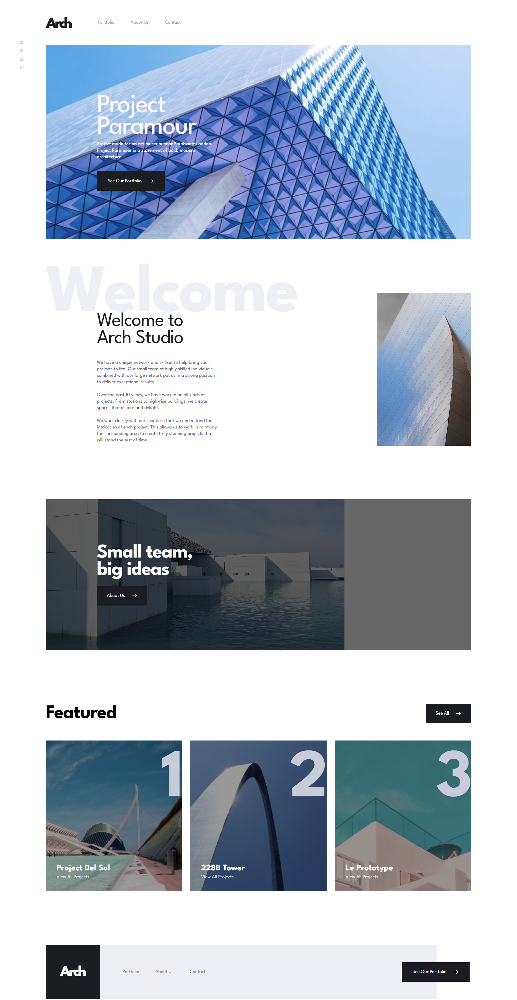

# Studio X App

<!-- ## For live preview click <strong>[here](https://payapi-app.netlify.app/)</strong>

## Desktop design overview home page

## Tablet design overview pricing page

## Mobile design overview mobile about page

## Development setup -->

1. Clone it
2. npm install
3. npm run start

## About Studio

> This project is a front mentor challenge ( [Front Mentor link ](https://www.frontendmentor.io/home))

## Build With

1. SASS
1. TYPESCRIPT
1. REACT.JS
