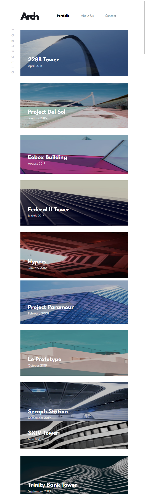
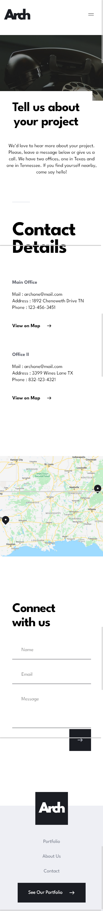

# Studio X App

## For live preview click <strong>[here](https://studio-x-portfolio.netlify.app/)</strong>

## Desktop design overview home page

## Tablet design overview Portfolio page

## Mobile design overview mobile Contact page

## Development setup -->

1. Clone it
2. npm install
3. npm run start

## About Studio

This project is a front mentor challenge ( [Front Mentor link ](https://www.frontendmentor.io/home))

## Build With

1. REACT.JS
1. TYPESCRIPT
1. SASS
